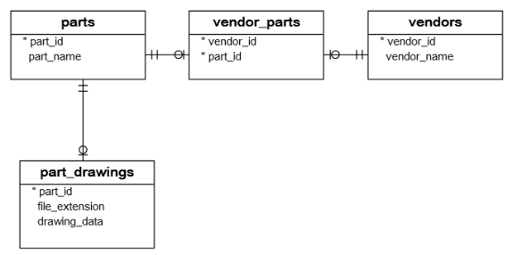

# Steps for creating PostgreSQL tables in Python{#createtable}

To create a new table in a PostgreSQL database, you use the following steps:

1. First, construct `CREATE TABLE` statements.

2. Next, connect to the PostgreSQL database by calling the `connect()` function. The `connect()` function returns a `connection` object.
3. Then, create a `cursor` object by calling the `cursor()` method of the `connect` object.
4. After that, execute the `create table` by calling the `execute()` method of the `cursor` object.
5. Finally, close the communication with the PostgreSQL database server by calling the `close()` methods of the `cursor` and `connection` objects.

## Creating tables in Python example

## Create a python program

First, create a new file called `creat_table.py`

Second, inside the `create_table.py` file, define a new function called `create_tables()`.

The `create_tables()` function creates four tables in the `suppliers` database: `vendor`, `parts`, `vendor_parts` and `part_drawing`. 

```{r, out.width='70%'}

```

```{python, eval=FALSE}
import psycopg2
from config import config

def create_tables():
    """create tables in the PostgreSQL database"""
    commands = (
        """
        CREATE TABLE vendors(
            vendor_id SERIAL PRIMARY KEY,
            vendor_name VARCHAR(255) NOT NULL
            )
        """,
        """
        CREATE TABLE parts (
            part_id SERIAL PRIMARY KEY,
            part_name VARCHAR(255) NOT NULL
        )
        """,
        """
        CREATE TABLE part_drawings (
            part_id INTEGER PRIMARY KEY,
            file_extension VARCHAR(255) NOT NULL,
            drawing_data BYTEA NOT NULL,
            FOREIGN KEY (part_id)
            REFERENCES parts (part_id)
            ON UPDATE CASCADE ON DELETE CASCADE
        )
        """,
        """
        CREATE TABLE vendor_parts (
            vendor_id INTEGER NOT NULL,
            part_id INTEGER NOT NULL,
            PRIMARY KEY (vendor_id, part_id),
            FOREIGN KEY (vendor_id)
                REFERENCES vendors (vendor_id)
                ON UPDATE CASCADE ON DELETE CASCADE,
            FOREIGN KEY (part_id)
                REFERENCES parts (part_id)
                ON UPDATE CASCADE ON DELETE CASCADE
        )
        """)
    conn = None
    try:
        # read the connection parameters
        params = config()
        # connect to the PostgreSQL sever
        conn = psycopg2.connect(**params)
        cur = conn.cursor()
        # create table one by one
        for command in commands:
            cur.execute(command)
        # close communication with the PostgreSQL database server
        cur.close()
        # commit the changes
        conn.commit()
    except (Exception, psycopg2.DatabaseError) as error:
        print(error)
    finally: 
        if conn is not None:
            conn.close()

if __name__ == '__main__':
    create_tables()

```

## Execute the Python program

To execute the program, you use the following command:

```{python, eval=FALSE}
python create_table.py
```

## Verify the table creation

First, log in the PostgreSQL database server using the psql program.

Second, use the `\dt` command to display the table list from the `suppliers`
database.

## TroubleShooting

Syntax error can be annoying, such as `ON UPDATE CASCADE ON DELETE CASCADE,`. There is a comma at the end of the sentence. It's hard to find that.

Table name is occurrence in different place. Be careful to the spelling, it has to be the same.
